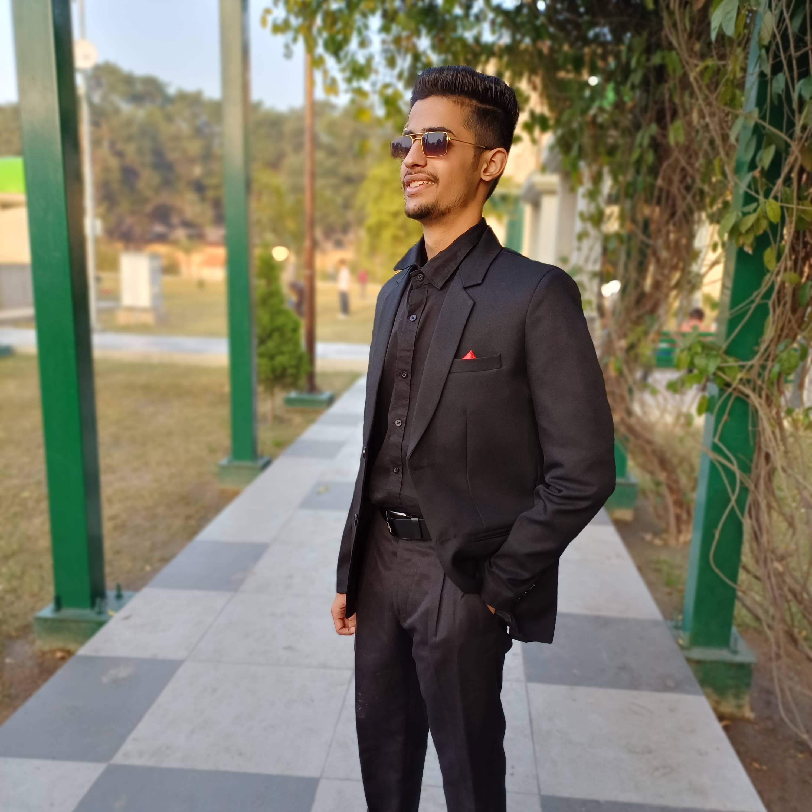

# ==PORTFOLIO==.

## Name:- VABHAV BHATEJA

 Greetings,I am Vabhav Bhateja, a passionate B.Tech Computer Science and Engineering student with the passion of learning and the exploring the tech field  

## 4. Academices

| ------------- |:-------------:| -----:|  
| Education     | year          | score |
| ------------- |:-------------:| -----:|
|marticulatiom  | 2020          | 90.4%|
|secondary education| 2024          | 90.4% |
| ------------- |:-------------:| -----:|

## Education
Degree Pursuing :- B.Tech Computer Science and Engineering
Institution     :- Guru Nanak dev Engineering College

## Skills
Technical Skills:- HTML,PYTHON And Learning C
Soft Skills     :- Communication, teamwork, problem-solving, etc

9. Extracurricular Activities
Clubs and Organizations :- NCC
Sports                  :- Football,Cricket
10. Certifications
 
###excel courese

## Contact Information
Email :- vabhavbhateja@gmail.com
contact :- 8360559166
linkdin porfile name :- Vabhav bhateja
